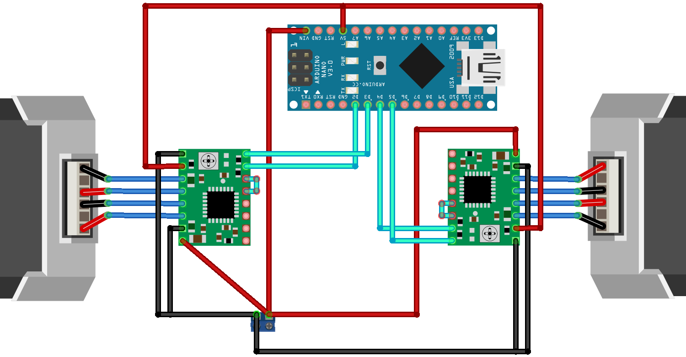

# Command interpreter for Mobile Robot

**Repository containing the source code and documentation for the operation of the command interpreter of a mobile robot developed by students at IFSC Campus Araranguá.**

## Table of Contents

- [Project Details](#project-details)
- [Documentation](#documentation)
  - [Configuration and Requirements](#configuration-and-requirements)
  - [Instructions for use](#instructions-for-use)
    - [Summary](#summary)
- [License](#license)

## Project Details
- Developed at the Federal Institute of Santa Catarina (IFSC) Campus Araranguá
- Integrated Technical Course in Electromechanics
- Integrative Project III discipline
- Team: Emanuel Cardoso Tavecia ([@emanueltavecia](https://github.com/emanueltavecia)), Bernardo Fernandes Spillere and Gabriel Dutra dos Santos
- Advisor: Werther Alexandre de Oliveira Serralheiro

## Documentation

- This project uses the Arduino platform.

### Configuration and Requirements

Before using the command interpreter for the mobile robot, it is important to correctly configure the environment and project requirements. Follow the instructions below:

- **Arduino Stepper Library**
  - Stepper motors are controlled using the Arduino "Stepper" library. Make sure you have this library installed in your development environment. If you don't already have it, you can install it from the Arduino IDE's Library Manager.

- **Stepper Motor Connection**
  - The robot's stepper motors are connected to the following Arduino ports:
    - Left Stepper Motor:
      - Step → Arduino Port 2
      - Direction → Arduino Port 3
    - Right Step Motor:
      - Step → Arduino Port 4
      - Direction → Arduino Port 5
  
  

- **Upload the code [`interpreter.ino`](interpreter.ino) to your Arduino**

### Instructions for use

- You must enter a code on the **serial monitor** starting with a letter, which will be the function to be executed (F, B, L or R), followed by two numbers: the first is the duration in seconds that the robot will move; and the second is the speed of the wheels.
  - Note 1: Code information must be **separated by a comma (,)**
  - Note 2: The function letter is case-insensitive
  - Note 3: Speeds have a minimum value of 1 and a maximum of 5
    - Speed 1: 500 rpm
    - Speed 2: 600 rpm
    - Speed 3: 700 rpm
    - Speed 4: 800 rpm
    - Speed 5: 1000 rpm

- The letter corresponds to the function that will be performed. You have the following options:

  - **F - forward**
    - Example:
      ```
      F,4,5
      ```
    - In this example the robot moves forward for 4 seconds. The wheels rotate at speed 5.

  - **B - backward**
    - Example:
      ```
      B,7,4
      ```
    - In this example the robot moves backwards for 7 seconds. The wheels rotate at speed 4.

  - **L - turn left**
    - Example:
      ```
      L,5,3
      ```
    - In this example, the robot turns left for 5 seconds. The wheels rotate at speed 3.

  - **R - turn right**
    - Example:
      ```
      R,2,2
      ```
    - In this example, the robot turns right for 2 seconds. The wheels rotate at speed 2.

  - **H - help**
    - Example:
      ```
      H
      ```
    - Sending "h" on the serial monitor will help you use the commands.

#### Summary

| Function | Duration | Speed | Code |
| :---: | :---: | :---: | :---: |
| F | 4 seconds | 5 | `F,4,5` |
| B | 7 seconds | 4 | `B,7,4` |
| L | 5 seconds | 3 | `L,4,3` |
| R | 2 seconds | 2 | `R,2,2` |

## License

This project is licensed under the [MIT License](LICENSE).

Copyright © 2023 [Emanuel Cardoso Tavecia](https://github.com/emanueltavecia), Bernardo Fernandes Spillere, and Gabriel Dutra dos Santos.

The MIT License is a permissive open-source license that allows you to freely use, modify, and distribute this software as long as you include the original copyright notice and the MIT License text with your distribution.
